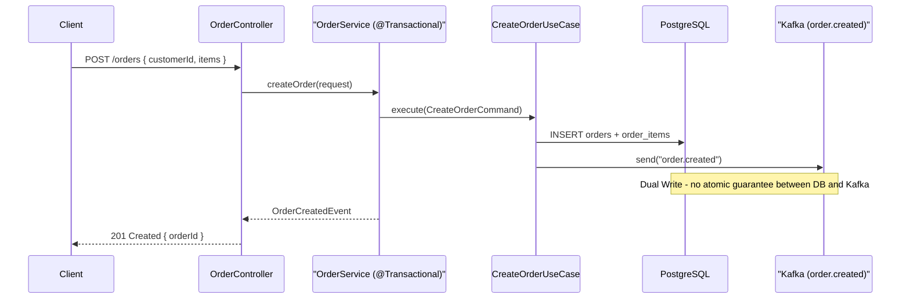

# Mars Enterprise Kit Lite

Mars Enterprise Kit Lite is a free, open-source **Order microservice** built with correct **Onion Architecture**, asynchronous communication via **Kafka (Redpanda)**, and persistence in **PostgreSQL** — but **without the Transactional Outbox Pattern**.

The absence of the Outbox is intentional: it exposes the Dual Write consistency problem in a real codebase, so you can understand it before solving it. This project is also an **AI-First lab** — it is designed from the ground up to be operated by Claude Code. The README is a prompt disguised as documentation.

**Target audience:**
- Software Engineers learning Onion Architecture with a real, functional example.
- Developers exploring AI-First development with Claude Code, Cursor, or Codex.
- Architects who want a well-structured Spring Boot template to extend.

## Tech Stack

[![Java][java-shield]][java-url]
[![Spring Boot][springboot-shield]][springboot-url]
[![Maven][maven-shield]][maven-url]
[![PostgreSQL][postgres-shield]][postgres-url]
[![Redpanda][redpanda-shield]][redpanda-url]
[![Docker][docker-shield]][docker-url]

## High Level Architecture Overview

The diagram below shows the internal structure of the microservice — a single Maven module with package-based Onion Architecture layers, enforced by ArchUnit tests.

```
┌─────────────────────────────────────────────────────────────────┐
│  mars-enterprise-kit-lite  (single Maven module, port 8082)     │
│                                                                 │
│  ┌──────────────────────────────────────────────────────────┐   │
│  │  api/  (HTTP Layer)                                      │   │
│  │  OrderController · CreateOrderRequest · OrderResponse    │   │
│  │  GlobalExceptionHandler · chaos/ (@Profile("chaos"))     │   │
│  └─────────────────────┬────────────────────────────────────┘   │
│                        │ depends on                             │
│  ┌─────────────────────▼────────────────────────────────────┐   │
│  │  infrastructure/  (Adapters)                             │   │
│  │  persistence/ · messaging/ · configuration/              │   │
│  │  OrderRepositoryImpl · OrderCreatedPublisher             │   │
│  │  OrderCancelledConsumer · KafkaConfiguration             │   │
│  └─────────────────────┬────────────────────────────────────┘   │
│                        │ depends on                             │
│  ┌─────────────────────▼────────────────────────────────────┐   │
│  │  domain/  (No JPA · No Kafka · No Spring Web)            │   │
│  │  Order · OrderRepository · OrderEventPublisher           │   │
│  │  CreateOrderUseCase (@Service) · CancelOrderUseCase      │   │
│  └──────────────────────────────────────────────────────────┘   │
│                                                                 │
│  ┌──────────────┐   ┌─────────────────────────────────────┐     │
│  │  PostgreSQL  │   │  Redpanda (Kafka-compatible)        │     │
│  │  16-alpine   │   │  Kafka: 9092 · Admin: 9644          │     │
│  │  Port: 5432  │   │  Schema Registry: 8081              │     │
│  └──────────────┘   └─────────────────────────────────────┘     │
└─────────────────────────────────────────────────────────────────┘
```

| Package | Description |
|---------|-------------|
| **domain/** | Domain and application layer. NO JPA, NO Kafka, NO Spring Web. Contains `Order`, ports (interfaces `OrderRepository`, `OrderEventPublisher`), `@Service` use cases, and domain events. ArchUnit enforces that nothing here depends on infrastructure or api. |
| **infrastructure/** | Infrastructure layer. Implements domain ports (JPA adapter, Kafka publisher/consumer). Manages Flyway migrations. Depends on domain/ only. |
| **api/** | HTTP entry point. Exposes REST endpoints, maps DTOs to domain objects. `OrderController` injects `CreateOrderUseCase` + `OrderRepository` directly — no service wrapper. Depends on domain/ ports only. |

## Prerequisites

Local execution requirements:

* [![Java][java-shield]][java-url] — Java 25 (LTS)
* [![Maven][maven-shield]][maven-url] — Maven 3.9+
* [![Docker][docker-shield]][docker-url] — Docker + Docker Compose

## Quick Start

```bash
# 1. Start infrastructure (PostgreSQL + Redpanda)
docker-compose up -d

# 2. Build the project
mvn clean install

# 3. Run the application (port 8082)
mvn spring-boot:run
```

The application starts at **http://localhost:8082**.

Flyway runs migrations automatically on startup.

---

## AI-First Development

This project is designed to be operated by an AI assistant. The infrastructure, context files, and custom commands exist so that Claude Code (or any capable AI agent) can spin up the environment, run the smoke test, and implement new features — with no manual intervention required.

### Philosophy

> The README is a prompt. The context files are the memory. The commands are the interface.

The files under `.mars/docs/` and `CLAUDE.md` form the AI's knowledge base: architecture rules, domain model, Onion Architecture law, Dual Write constraints, TDD workflow. When Claude Code reads those files before acting, it avoids architectural mistakes and follows the project's conventions without needing to ask.

### AI Context Files

| File | Purpose |
|------|---------|
| `CLAUDE.md` | Primary instruction file: architecture rules, conventions, TDD workflow, what to do and what never to do |
| `.mars/docs/mars-enterprise-kit-context-lite.md` | Full project context: domain model, Kafka topics, event payloads, ADRs |
| `.mars/PRPs/templates/prp_base.md` | Template used by `/generate-prp` to structure feature implementation prompts |

### Custom Claude Code Commands

Two slash commands are available in this project. Run them from inside Claude Code:

#### `/generate-prp <feature-description>`

Generates a **PRP (Product Requirements Prompt)** for a new feature. A PRP is a structured, self-contained prompt designed to give an AI agent all the context it needs to implement a feature correctly in one pass — without hallucinating architecture, violating module boundaries, or skipping TDD.

**What it does:**
1. Reads `CLAUDE.md` and `.mars/docs/` to understand the codebase
2. Searches for existing patterns to reference (entities, use cases, DTOs)
3. Researches external docs if needed (Spring Boot, JPA)
4. Writes a complete PRP to `.mars/PRPs/{feature-name}.md` — including module structure, implementation blueprint, validation gates, and a confidence score

**Example:**
```
/generate-prp add GET /orders endpoint with pagination
```

**Output:** `.mars/PRPs/add-pagination-to-orders.md` — ready for execution.

---

#### `/execute-prp <path-to-prp>`

Executes a PRP file. The agent reads the PRP, plans the implementation layer by layer (Domain → Infrastructure → API), and writes code following strict TDD: tests first, then implementation, then refactor.

**What it does:**
1. Loads the PRP and re-reads `CLAUDE.md` for conventions
2. Thinks hard about the full implementation plan (ULTRATHINK phase)
3. Executes layer by layer, inside out:
   - **Phase 1** — `business/`: domain objects, ports, use cases (pure Java, no frameworks)
   - **Phase 2** — `data-provider/`: JPA entities, adapters, Flyway migrations
   - **Phase 3** — `app/`: services, controllers, DTOs, Kafka wiring
4. Runs the validation gates from the PRP (`mvn test`, `mvn verify`)
5. Reports completion or surfaces failing tests to fix

**Example:**
```
/execute-prp .mars/PRPs/add-pagination-to-orders.md
```

---

### Smoke Test (AI-Orchestrated)

Ask Claude Code to run the smoke test and it will execute the full flow autonomously:

```
Run the smoke test for this project
```

Claude Code will:
1. Start Docker Compose (PostgreSQL + Redpanda)
2. Verify Kafka topics exist
3. Create an order via `POST /orders` and validate the response
4. Consume the `order.created` event and verify the payload
5. Publish an `order.cancelled` event to Kafka
6. Query the order via `GET /orders/{id}` and verify `status == "CANCELLED"`
7. Tear down Docker Compose
8. Report: `✅ PASS` or `❌ FAIL` with logs

---

### Chaos Testing Skills

Beyond PRPs and smoke tests, the project includes **chaos testing skills** that Claude Code executes autonomously to demonstrate Dual Write failures in real time. See [Chaos Testing](#chaos-testing--proving-the-dual-write-problem) for the full details.

| Skill | Scenario | What it does |
|-------|----------|--------------|
| `chaos-phantom-event` | Phantom Event | Starts the app with profile `chaos`, calls `POST /chaos/phantom-event`, verifies the event exists in Kafka but the order does NOT exist in PostgreSQL |
| `chaos-testing` | Lost Event | Stops Redpanda, creates an order, verifies the order exists in PostgreSQL but the event is LOST in Kafka |

**Run them from Claude Code:**

```
Run the chaos-phantom-event skill
Run the chaos-testing skill with scenario lost-event
```

---

### Using with Cursor, Codex, or Other AI Assistants

`CLAUDE.md` is the instruction file for Claude Code. Other AI tools use different file names for the same concept:

| Tool | Instruction file |
|------|-----------------|
| Claude Code | `CLAUDE.md` |
| Cursor | `AGENTS.md` (or `.cursorrules`) |
| OpenAI Codex | `AGENTS.md` |
| GitHub Copilot Workspace | `AGENTS.md` |

**To use this project with Cursor or Codex**, copy or rename `CLAUDE.md` to `AGENTS.md` at the project root. The content works as-is — it describes the architecture, conventions, and rules in plain language that any AI agent can follow.

```bash
cp CLAUDE.md AGENTS.md
```

The `.mars/docs/` context files and `.mars/PRPs/` are tool-agnostic and work with any agent that can read files.

---

## API Endpoints

| Method | Path | Description | Response |
|--------|------|-------------|----------|
| `POST` | `/orders` | Create a new order | `201 Created` + `{ "orderId": "uuid" }` |
| `GET` | `/orders/{id}` | Get order by ID | `200 OK` + order payload |
| `GET` | `/actuator/health` | Health check | `200 OK` |
| `POST` | `/chaos/phantom-event` | Simulate phantom event (chaos testing) | `200 OK` + report |

No authentication. No rate limiting. Endpoints are open by design — this is an educational project.

> **Note:** The chaos endpoint requires starting the app with `SPRING_PROFILES_ACTIVE=chaos`. See [Chaos Testing](#chaos-testing--proving-the-dual-write-problem) below.

### POST /orders — Request Body

```json
{
  "customerId": "550e8400-e29b-41d4-a716-446655440000",
  "items": [
    {
      "productId": "6ba7b810-9dad-11d1-80b4-00c04fd430c8",
      "quantity": 2,
      "unitPrice": 149.95
    }
  ]
}
```

### GET /orders/{id} — Response Body

```json
{
  "id": "xxxxxxxx-xxxx-xxxx-xxxx-xxxxxxxxxxxx",
  "customerId": "550e8400-e29b-41d4-a716-446655440000",
  "status": "CREATED",
  "total": 299.9,
  "items": [
    { "productId": "...", "quantity": 2, "unitPrice": 149.95 }
  ],
  "createdAt": "2026-02-21T10:00:00Z",
  "updatedAt": "2026-02-21T10:00:00Z"
}
```

## Communication Overview

The Order microservice communicates with external systems via Kafka events (Redpanda, JSON format). No Schema Registry. No Avro.

### Topics Published

Events that the order-service **produces**:

| Event | Topic | Description |
|-------|-------|-------------|
| Order Created | `order.created` | Published after a new order is persisted in PostgreSQL. ⚠️ Dual Write — no atomic guarantee. |

### Queues Consumed

Events that the order-service **consumes**:

| Event | Topic | Description | Type |
|-------|-------|-------------|------|
| Order Cancelled | `order.cancelled` | Triggers cancellation of an existing order, updating status to `CANCELLED` in PostgreSQL. | PERSISTENT |

### Event Payloads

**`order.created` — Published payload (JSON):**
```json
{
  "eventId": "uuid-v4",
  "orderId": "uuid-v4",
  "customerId": "uuid-v4",
  "totalAmount": 299.90,
  "items": [
    { "productId": "uuid-v4", "quantity": 2, "unitPrice": 149.95 }
  ],
  "occurredAt": "2026-02-21T10:00:00Z"
}
```

**`order.cancelled` — Consumed payload (JSON):**
```json
{
  "eventId": "uuid-v4",
  "orderId": "uuid-v4",
  "reason": "Customer requested cancellation",
  "occurredAt": "2026-02-21T10:05:00Z"
}
```

## UML Diagrams — Main Flows

### Flow 1: Create Order (Publisher)



### Flow 2: Cancel Order (Consumer)


### Flow 3: AI-First Smoke Test (Claude Code Orchestrated)


## The Dual Write Anti-Pattern (Intentional)

This is the most important section of this README.

Distributed systems that need to **persist data AND publish events** face a fundamental challenge: there is no native atomicity between a relational database and a message broker.

The naive — and most common — solution is **Dual Write**: save to the database, then publish to Kafka inside a `@Transactional`. Spring manages the DB rollback on failure, but **does not undo an already-published Kafka event**. The reverse is also true: if Kafka goes down after the DB commit, the event is silently lost.

```
POST /orders
  │
  @Transactional
  ├── 1. INSERT INTO orders ✅ (saved)
  └── 2. kafkaTemplate.send("order.created") → 💥 failure
           │
           Result: Order exists in DB.
                   Event never reached the consumer.
                   Silent inconsistency.
```

**This is exactly the scenario this project reproduces — by design.**

In production with high concurrency, this inconsistency window is enough to generate ghost orders — saved in the database, invisible to other services. The Transactional Outbox Pattern solves this. The Lite version exposes the problem so that you feel it.

## Chaos Testing — Proving the Dual Write Problem

The Lite version doesn't just describe the Dual Write problem — it **proves** it with two reproducible chaos scenarios. Each scenario demonstrates a different failure mode, and each has a dedicated Claude Code skill that orchestrates the test end-to-end.

### Scenario 1: Phantom Event (Ghost Event in Kafka)

**The problem:** A Kafka event references an order that **does not exist** in PostgreSQL. Any consumer processing this event will fail or create downstream inconsistencies.

**How to reproduce:** The project includes a built-in chaos endpoint (`POST /chaos/phantom-event`) that uses an AOP interceptor to force a DB rollback after the Kafka event has already been published.

```bash
# Start the app with the chaos profile
SPRING_PROFILES_ACTIVE=chaos mvn spring-boot:run

# Trigger the phantom event
curl -s -X POST http://localhost:8082/chaos/phantom-event \
  -H "Content-Type: application/json" \
  -d '{
    "customerId": "550e8400-e29b-41d4-a716-446655440000",
    "items": [
      {"productId": "6ba7b810-9dad-11d1-80b4-00c04fd430c8", "quantity": 2, "unitPrice": 149.95}
    ]
  }'
```

**Response:**

```json
{
  "orderId": "xxxxxxxx-xxxx-xxxx-xxxx-xxxxxxxxxxxx",
  "existsInDb": false,
  "eventSentToKafka": true,
  "dbRolledBack": true,
  "explanation": "PHANTOM EVENT: The order.created event was published to Kafka, but the order does NOT exist in PostgreSQL. Any consumer processing this event will reference a non-existent order."
}
```

**Verification:**

```bash
# Order does NOT exist in PostgreSQL (rolled back)
docker-compose exec postgres psql -U mars -d orders_db -c \
  "SELECT * FROM orders WHERE id = '<orderId>';"
# → (0 rows)

# Event DOES exist in Kafka
docker-compose exec redpanda rpk topic consume order.created --num 1 --offset end
# → Event payload with the phantom orderId
```



```mermaid
sequenceDiagram
    participant Client as Client
    participant CC as ChaosController
    participant SVC as "ChaosService (@Transactional)"
    participant AOP as "PhantomEventChaosAspect (@Around)"
    participant UC as CreateOrderUseCase
    participant DB as PostgreSQL
    participant K as "Kafka (order.created)"

    Client->>CC: POST /chaos/phantom-event
    CC->>SVC: attemptPhantomOrder(input)
    Note over SVC: @Transactional BEGINS
    SVC->>AOP: execute(input)
    AOP->>UC: proceed() → execute(input)
    UC->>DB: INSERT orders + order_items
    UC->>K: send("order.created")
    Note over K: Event sent immediately (irreversible)
    UC-->>AOP: return orderId
    AOP--xSVC: throw PhantomEventSimulationException
    Note over SVC: @Transactional ROLLBACK
    Note over DB: INSERT rolled back (order gone)
    SVC--xCC: exception propagates
    CC->>SVC: orderExists(orderId)
    SVC->>DB: SELECT ... WHERE id = orderId
    DB-->>SVC: empty (not found)
    CC-->>Client: 200 OK { existsInDb: false, eventSentToKafka: true }
```

> **How it works internally:** `PhantomEventChaosAspect` is an AOP `@Around` advice that intercepts `ChaosOrderExecutor.execute()`. It lets the use case run completely (DB INSERT + Kafka publish), then throws a `PhantomEventSimulationException`. Since the exception occurs inside the `@Transactional` boundary, Spring rolls back the DB — but `KafkaTemplate.send()` already dispatched the event. All chaos beans use `@Profile("chaos")` and don't exist in the default profile.

---

### Scenario 2: Lost Event (Kafka Down)

**The problem:** An order is persisted in PostgreSQL, but the corresponding Kafka event is **never published**. Downstream consumers never learn the order was created.

**How to reproduce:** Stop Redpanda before creating an order. The DB commit succeeds, but the Kafka publish fails or hangs.

```bash
# 1. Create a baseline order (everything healthy)
curl -s -X POST http://localhost:8082/orders \
  -H "Content-Type: application/json" \
  -d '{"customerId":"550e8400-e29b-41d4-a716-446655440000","items":[{"productId":"6ba7b810-9dad-11d1-80b4-00c04fd430c8","quantity":1,"unitPrice":50.00}]}'
# → 201 Created

# 2. Kill Kafka
docker-compose stop redpanda

# 3. Try to create another order
curl -s -X POST http://localhost:8082/orders \
  -H "Content-Type: application/json" \
  -d '{"customerId":"aaaaaaaa-bbbb-cccc-dddd-eeeeeeeeeeee","items":[{"productId":"11111111-2222-3333-4444-555555555555","quantity":1,"unitPrice":99.99}]}'

# 4. Bring Kafka back
docker-compose start redpanda
sleep 10

# 5. Compare: DB has 2 orders, Kafka has only 1 event
docker-compose exec postgres psql -U mars -d orders_db -c "SELECT COUNT(*) FROM orders;"
docker-compose exec redpanda rpk topic consume order.created --format '%v\n' | wc -l
```

```
┌─────────────────────────────────────────────────────┐
│  LOST EVENT                                          │
│                                                      │
│  ┌──────────┐          ┌──────────┐                  │
│  │ PostgreSQL│          │  Kafka   │                  │
│  │ 2 orders │          │ 1 event  │                  │
│  └──────────┘          └──────────┘                  │
│                                                      │
│  Order #2 exists in DB but has NO corresponding      │
│  event in Kafka. Consumers don't know it exists.     │
└─────────────────────────────────────────────────────┘
```

---

### Side-by-Side: Two Faces of the Same Problem

Both scenarios are caused by the same root issue: **no atomicity between PostgreSQL and Kafka**.

| | Scenario 1: Phantom Event | Scenario 2: Lost Event |
|---|---|---|
| **Trigger** | AOP forces DB rollback after publish | Kafka is down during order creation |
| **PostgreSQL** | Order does NOT exist (rolled back) | Order EXISTS (committed) |
| **Kafka** | Event EXISTS (already sent) | Event does NOT exist (publish failed) |
| **Impact** | Consumers process a non-existent order | Consumers never learn the order was created |
| **Reproduction** | `POST /chaos/phantom-event` (requires `chaos` profile) | `docker-compose stop redpanda` + `POST /orders` |
| **Claude Code Skill** | `chaos-phantom-event` | `chaos-testing` |
| **Fix** | Transactional Outbox Pattern | Transactional Outbox Pattern |

> Both failures are silent in production. There are no errors in the logs, no alerts, no retries. The system continues operating with inconsistent state between the database and the message broker. **The Transactional Outbox Pattern prevents both scenarios** by writing events to an outbox table within the same DB transaction, then relaying to Kafka asynchronously with at-least-once delivery.

## Monitoring

| Dashboard | URL |
|-----------|-----|
| Redpanda Console | http://localhost:8080 |
| Spring Boot Actuator | http://localhost:8082/actuator/health |
| PostgreSQL | `docker exec -it <postgres-container> psql -U mars -d orders_db` |

## Troubleshooting

```bash
# View service logs
docker-compose logs -f postgres
docker-compose logs -f redpanda

# Restart everything (clean slate)
docker-compose down -v && docker-compose up -d --force-recreate

# Port already in use (app port is 8082, NOT 8081 — Redpanda uses 8081)
lsof -i :8082 && kill -9 <PID>

# Force rebuild Maven dependencies
mvn clean install -U

# Flyway migration issues
mvn flyway:info
mvn flyway:repair
```

## Running Tests

```bash
mvn test                                          # All tests (50 tests total)
mvn test -Dtest=ArchitectureTest                  # Architecture rules (12 tests, fast)
mvn test -Dtest=CreateOrderUseCaseTest            # Single test class
mvn test -Dtest=CreateOrderUseCaseTest#shouldSaveOrderAndPublishEvent  # Single method
mvn clean verify                                  # Full build + all tests
```

> TestContainers requires Docker running locally.

## Project Structure

```
mars-enterprise-kit-lite/
├── .mars/
│   ├── docs/
│   │   └── mars-enterprise-kit-context-lite.md   # Full project context (AI reads this)
│   └── PRPs/
│       ├── templates/
│       │   └── prp_base.md                       # PRP template for /generate-prp
│       └── {feature-name}.md                     # Generated PRPs live here
├── .claude/
│   ├── commands/
│   │   ├── generate-prp.md                       # /generate-prp command definition
│   │   └── execute-prp.md                        # /execute-prp command definition
│   └── skills/
│       ├── chaos-phantom-event/                   # Skill: phantom event chaos test
│       ├── chaos-testing/                         # Skill: lost event chaos test (infra-based)
│       ├── exploratory-testing/                   # Skill: end-to-end smoke test
│       └── git-worktree-prp/                      # Skill: worktree lifecycle for PRPs
├── src/
│   ├── main/
│   │   ├── java/io/mars/lite/
│   │   │   ├── Application.java
│   │   │   ├── domain/                           # Domain layer (no JPA/Kafka/Web)
│   │   │   │   └── usecase/                      # @Service use cases
│   │   │   ├── infrastructure/                   # Adapters (JPA, Kafka, config)
│   │   │   │   ├── persistence/
│   │   │   │   ├── messaging/
│   │   │   │   └── configuration/
│   │   │   └── api/                              # HTTP endpoints + chaos testing
│   │   │       └── chaos/                        # @Profile("chaos") only
│   │   └── resources/
│   │       ├── application.yaml
│   │       └── db/migration/V1__create_orders_table.sql
│   └── test/
│       └── java/io/mars/lite/
│           ├── ArchitectureTest.java             # 12 ArchUnit rules
│           ├── AbstractIntegrationTest.java
│           ├── domain/ · infrastructure/ · api/  # Tests by layer
├── docker-compose.yml                            # PostgreSQL + Redpanda
├── pom.xml                                       # Single POM (packaging=jar)
├── CLAUDE.md                                     # AI instruction file (copy → AGENTS.md for Cursor/Codex)
└── README.md                                     # This file
```

---

## ⚠️ Ready for Production?

This project intentionally demonstrates the **Dual Write problem**.
In production, you need atomic guarantees between your database and Kafka.

When Kafka goes down after the DB commit, your event is silently lost. When the Kafka publish succeeds but the DB rolls back, you have a ghost event with no matching record. The Lite version exposes this so you feel the problem before you need to solve it.

The solution is the **Transactional Outbox Pattern**.

👉 **[Follow the progress at programmingonmars.io](https://programmingonmars.io)**

---

**Owner:** Andre Lucas — [Andre Lucas](https://www.linkedin.com/in/andre-lucastic/)
**License:** MIT
**Version:** 1.0.0

<!-- MARKDOWN LINKS & IMAGES -->
[java-shield]: https://img.shields.io/badge/Java%2025-ED8B00?logo=openjdk&logoColor=white&style=for-the-badge
[java-url]: https://openjdk.org/projects/jdk/25/
[springboot-shield]: https://img.shields.io/badge/Spring%20Boot%204.0-6DB33F?logo=springboot&logoColor=white&style=for-the-badge
[springboot-url]: https://spring.io/projects/spring-boot
[maven-shield]: https://img.shields.io/badge/Maven%203.9-C71A36?logo=apachemaven&logoColor=white&style=for-the-badge
[maven-url]: https://maven.apache.org/
[postgres-shield]: https://img.shields.io/badge/PostgreSQL%2016-4169E1?logo=postgresql&logoColor=white&style=for-the-badge
[postgres-url]: https://www.postgresql.org/
[redpanda-shield]: https://img.shields.io/badge/Redpanda-E5484D?logo=apachekafka&logoColor=white&style=for-the-badge
[redpanda-url]: https://docs.redpanda.com/
[docker-shield]: https://img.shields.io/badge/Docker-2496ED?logo=docker&logoColor=white&style=for-the-badge
[docker-url]: https://www.docker.com/
